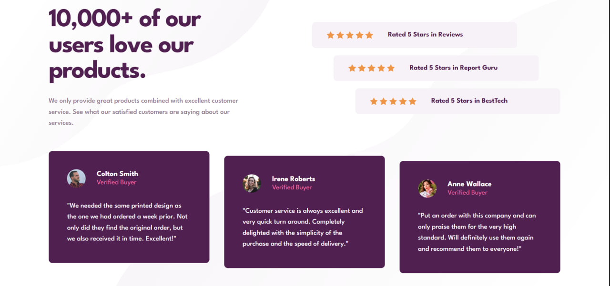

# Frontend Mentor - Social Proof Section Solution

This is my personal solution to the [Social Proof Section challenge on Frontend Mentor](https://www.frontendmentor.io/challenges/social-proof-section-6e0qTv_bA). 

## Table of contents

- [Overview](#overview)
  - [The challenge](#the-challenge)
  - [Screenshot](#screenshot)
  - [Links](#links)
- [My process](#my-process)
  - [Built with](#built-with)
  - [What I learned](#what-i-learned)
  - [Continued development](#continued-development)

## Overview

### The challenge

Users should be able to:
- View the optimal layout for the section depending on their device's screen size (Responsive design down to 375px mobile viewports).

### Screenshot



### Links

- Solution URL: [Frontend Mentor Solution Page](https://www.frontendmentor.io/solutions/responsive-social-proof-section-using-css-grid-flexbox-ucpN)
- Live Site URL: [Live Deployment Link](https://social-proof-section1-one.vercel.app/)

## My process

### Built with

- Semantic HTML5 structural landmarks (`<main>`, `<section>`, `<footer>`)
- CSS Custom Properties (Variables)
- CSS Grid (For 2-column hero section and 3-column review card rows)
- CSS Flexbox (For star rating internal layout structures)
- Mobile-responsive adjustments using media breakpoints
- Google Fonts integration (`League Spartan` typography)

### What I learned

During this challenge, I practiced handling asymmetric layouts and responsive grid configurations. 

1. **Stair-Step Staggering:** I learned how to use individual item alignment (`align-self`) within flexible column flows and explicit grid row heights to cascade the elements into a diagonal path without breaking the semantic layout stream:
```css
/* Staggering the star rating rows */
.rating-card:nth-child(1) { align-self: flex-start; }
.rating-card:nth-child(2) { align-self: center; }
.rating-card:nth-child(3) { align-self: flex-end; }